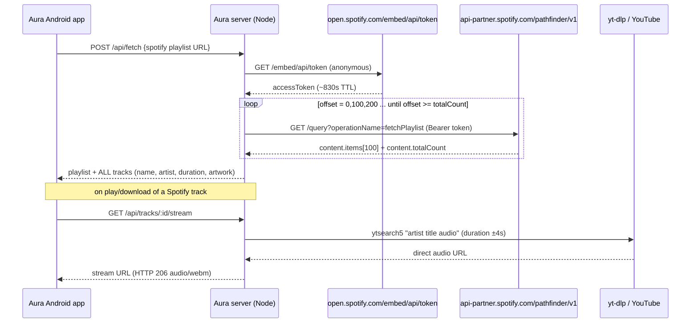

# Spotify keyless playlist fetching — reverse-engineering report

- Date: 2026-09-26
- Case: `work/20260926-201246-reverse-engineer-spotify-public/scope.md` (auth granted, `authorized_target_only`, GET only)
- Scope: public, unauthenticated Spotify surfaces + this repository. No credentials, no login, no auth bypass, no writes against Spotify.
- Flavor: `null` (routine web/API reverse engineering for a personal tool)

## Summary

Aura's Spotify importer previously required `SPOTIFY_CLIENT_ID` /
`SPOTIFY_CLIENT_SECRET`. This task removed that requirement entirely: the
provider now reads playlists through the same **anonymous** surfaces the public
Spotify web player uses, and pages them until the playlist's real total is
reached — so **full-length playlists import completely, with zero configuration**.

Verified end-to-end:

| Playlist | Expected | Imported | Duplicates | Metadata gaps |
|---|---|---|---|---|
| `37i9dQZF1DWX83CujKHHOn` (Alone Again, >100) | 150 | **150** | 0 | 0 |
| `39s4GAy7yGZjWoW6zGIkJK` (Fav songs, user-supplied) | 62 | **62** | 0 | 0 |

Audio resolution (unchanged path, re-verified): HTTP **206**, `audio/webm`,
bytes served from `googlevideo.com`.

## Evidence → Finding → Path

### E1 — the credential requirement was the only credential requirement

- Evidence: `server/src/providers/spotify.ts` (old) called
  `accounts.spotify.com/api/token` with client-credentials; `canHandle()` for
  every other provider (yt-dlp, direct) needed no keys. `/api/health` exposed
  `spotify: false` without `.env` entries.
- Finding: **F1** — removing credentials from *this one file* makes the whole
  app keyless.
- Path: rewrite `server/src/providers/spotify.ts`.

### E2 — public surfaces triaged for track data

| Surface | Capture | Result |
|---|---|---|
| `open.spotify.com/oembed` | `evidence/oembed-todays-top-hits.json` | title + artwork only, **no tracks** |
| `open.spotify.com/embed/playlist/<id>` | `evidence/embed-*.html` | SSR `__NEXT_DATA__` → `entity.trackList` |
| embed cap test | `embed-todays-top-hits`=50, `embed-deep`=100, `embed-over100`=**100 of 150** | **hard cap at 100** |
| main `/playlist/<id>` | `evidence/main-over100.html` | client-rendered, no embedded tracks |
| embed `/_next/data/<build>/...` | `evidence/next-data-over100.json` | same SSR payload, same cap |

- Finding: **F2** — the embed SSR surface alone can *never* satisfy "full
  playlist": it truncates at 100 tracks.

### E3 — static analysis of captured JS

- Evidence (`evidence/7544-*.js`, embed bundle):
  - anonymous token: `GET /embed/api/token` →
    `{accessToken, accessTokenExpirationTimestampMs, isAnonymous}`
    (observed ~830 s TTL; capture `evidence/embed-token.json`, HTTP 200)
  - GraphQL base: `https://api-partner.spotify.com/pathfinder/v1` + `/query`
  - auth: `Authorization: Bearer <accessToken>` — no client-credentials, no user login
- Evidence (`evidence/web-player.js`, main bundle):
  - persisted-query registry:
    `fetchPlaylist` = `243c0ba2736f16da721e3a227004bbcdb8df6c846f198bd478172e00aa1faf42`
  - caller: `getPlaylistInternal(uri,{offset,limit})` →
    `query(fo,{uri,offset,limit,enableWatchFeedEntrypoint,includeEpisodeContentRatingsV2})`
  - transport: `{variables, operationName, extensions:{persistedQuery:{version:1,sha256Hash}}}`
- Finding: **F3** — a complete, credential-free paging mechanism exists and is
  exactly what the official web player itself uses.

### E4 — dynamic validation (read-only GET)

```text
GET /pathfinder/v1/query?operationName=fetchPlaylist&variables=...&extensions=...
Authorization: Bearer <anonymous embed token>
→ HTTP 200, data.playlistV2.__typename = "Playlist"
```

Full walk, evidence `evidence/full-pagination-result.json`:

```text
37i9dQZF1DWX83CujKHHOn: page(0)=100, page(100)=50, totalCount=150 → fetched 150, dupes 0
39s4GAy7yGZjWoW6zGIkJK: page(0)=62,  totalCount=62  → fetched 62,  dupes 0
```

- Finding: **F4** — offset/limit paging against `content.totalCount` yields
  100% coverage. Confidence: **high** (two independent playlists, both exact).

### E5 — verified response schema

```text
data.playlistV2
  __typename "Playlist"
  name, description
  images.items[0].sources[0].url          ← playlist artwork
  content.__typename "PlaylistItemsPage"
  content.totalCount                      ← ground truth for full-list assertion
  content.pagingInfo {limit, offset}
  content.items[]
    itemV2.data.__typename "Track" | "Episode" | ...
      uri, name
      artists.items[].profile.name
      trackDuration.totalMilliseconds
      albumOfTrack.{name, coverArt.sources[]}
```

## Implementation

`server/src/providers/spotify.ts` (rewritten):

1. `getToken()` — `GET https://open.spotify.com/embed/api/token`, cached until
   `accessTokenExpirationTimestampMs - 30s`; one refresh-and-retry on 401/403.
2. `fetchPage(uri, offset)` — pathfinder `fetchPlaylist`, page size 100.
3. `fetch()` — loops pages until `offset >= content.totalCount` (max 100 pages
   = Spotify's own 10k cap), de-dupes by track id, skips non-`Track` items
   (episodes/local files), 250 ms gap between pages.
4. `resolve()` — unchanged: yt-dlp `ytsearch5` match, duration ±4 s, then
   direct audio URL.

Also changed:

- `server/src/config.ts` — dropped `SPOTIFY_CLIENT_ID` / `SPOTIFY_CLIENT_SECRET`.
- `server/src/routes/misc.ts` — dropped dead credential imports; health now
  reports `spotify: true` unconditionally.
- `server/.env`, `server/.env.example`, `README.md` — credential instructions
  removed.

## Reproduction

```bash
cd server && npm run typecheck          # tsc --noEmit → clean
TOKEN=$(curl -s https://open.spotify.com/embed/api/token | jq -r .accessToken)
curl -G "https://api-partner.spotify.com/pathfinder/v1/query" \
  --data-urlencode "operationName=fetchPlaylist" \
  --data-urlencode 'variables={"uri":"spotify:playlist:39s4GAy7yGZjWoW6zGIkJK","offset":0,"limit":100,"enableWatchFeedEntrypoint":false,"includeEpisodeContentRatingsV2":false}' \
  --data-urlencode 'extensions={"persistedQuery":{"version":1,"sha256Hash":"243c0ba2736f16da721e3a227004bbcdb8df6c846f198bd478172e00aa1faf42"}}' \
  -H "Authorization: Bearer $TOKEN"
```

Server-level verification (port 8799, leaving the user's running instance on
8787 untouched):

```text
GET  /api/health              → "spotify": true
POST /api/fetch {url: .../37i9dQZF1DWX83CujKHHOn} → added 150, total 150
GET  /api/playlists/pl_...     → 150/150 tracks, duration>0 150/150, art 150/150, unique ids 150/150
resolve(Wolves...)             → rr4-...googlevideo.com, HTTP 206 audio/webm 1024 bytes
```

## Request flow



## Limitations & notes

- Public playlists only (private ones return NotFound → 404 as before).
- The `fetchPlaylist` persisted-query hash is Spotify's; if Spotify rotates it,
  fetch fails loudly with `Spotify query error: PersistedQueryNotFound` rather
  than silently truncating. Re-extract the hash from the current
  `web-player.*.js` bundle to repair.
- Token endpoint and pathfinder are read-only GETs; no account, no cookies, no
  writes. The 250 ms inter-page delay keeps request volume low.
- Spotify serves no audio — playback still resolves via yt-dlp search matching
  (README's existing "Where audio comes from" note applies).
- Personal/graduation-project use. You are responsible for complying with the
  terms of the platforms you point the server at.
